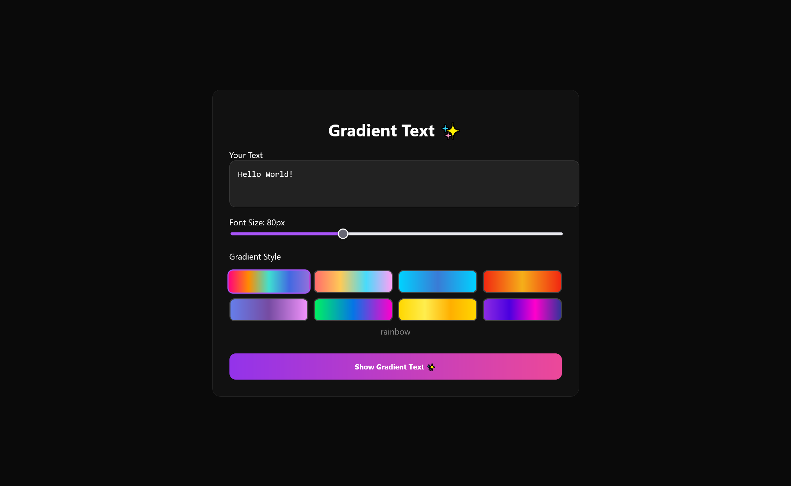
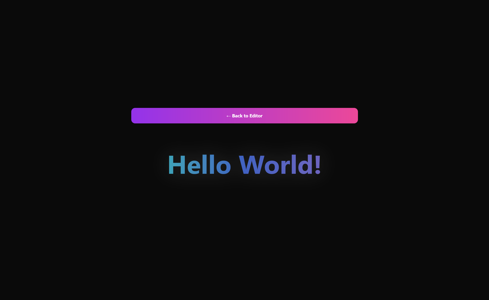

# Gradient Text 

очередной продукт гавна-вайбкодинга. Сделано Claude, перенесено в HTML Чатом ГПТ

Превращает обычный текст в переливающийся градиент. Создавал изначально для друга, который постоянно уходил ссать и ему надо было уведомить об этом. Тогда он заходил на сайт и писал что-то в духе "я ссу"

https://gradient-text2.vercel.app/

